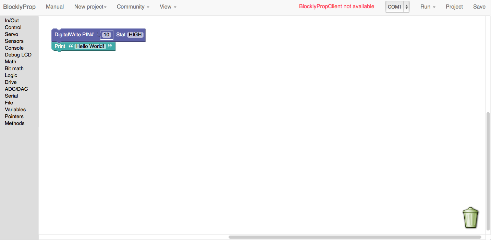
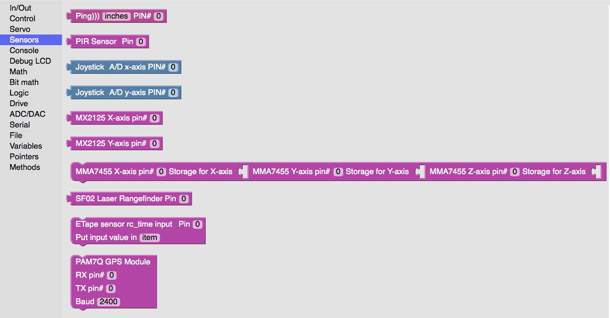

  

    <h2>About</h2>
    
BlocklyProp is a small, easy, and lightweight program that runs online and allows the beginner to easily program the Propeller with little to no programming experience required.

  

  

  

  
 
    <h3>Easy programming</h3>
    
The features every beginner wants to have in an introductory IDE, without the sluggishness of a larger and bulkier IDE. BlocklyProp is simple and implements an easy to use drag-and-drop interface, allowing the user to quickly program the Propeller without any hassle.

  

  
 
    <h3>Designed for the Propeller</h3>
    
Only blocks that are compatible have been added to BlocklyProp, and everything has been tested to ensure the highest quality product for the user.

  

  
 
    <h3>Drag-and-drop on any computer</h3>
    
A lightweight system means multi-platform support; program the Propeller on any of your computers!

  

