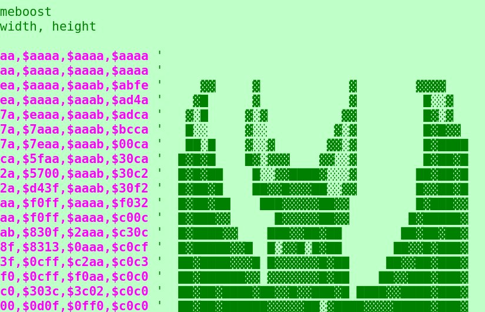
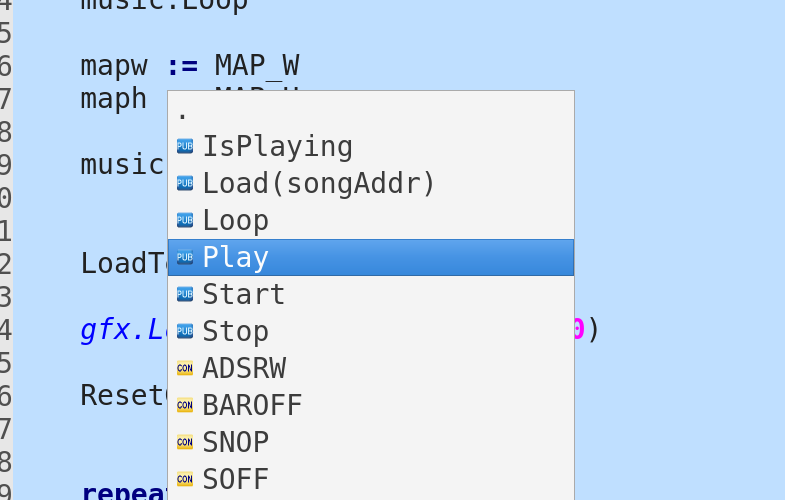
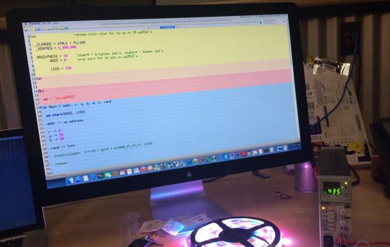

{:.img-responsive}

  

    <h2>About</h2>
    
PropellerIDE is a clean, cross-platform environment for Propeller Spin development. Write Spin code, download programs to your Propeller board, and debug your applications with the built-in serial terminal.

  

  

  

  
 
    <h3>Simplified editing</h3>
    
The features you want, without the noise of a bigger development tool. PropellerIDE is small, lean, and fast, like the Propeller.

  

  
 
    <h3>Designed for Spin</h3>
    
Auto-indent, code suggestion, auto-completion, everything you'd expect from your new favorite Spin IDE.

  

  
 
    <h3>Propeller anywhere</h3>
    
A minimal footprint means new platforms; program the Propeller on your Raspberry Pi!

  

